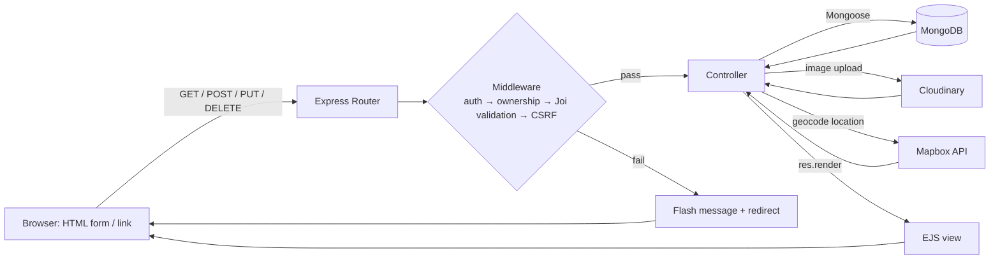

# StayNest 🧳

A full-stack, server-rendered Airbnb-style rental listing & booking platform — internally branded **"Wanderlust"**. Built with Node.js, Express, and MongoDB.

Browse listings, view them on an interactive map, leave star ratings and reviews, and book a stay for specific dates — with real server-side conflict detection so two guests can never double-book the same nights.

## Features

- **Listings** — full CRUD with photo upload straight to Cloudinary, and forward-geocoded coordinates (via Mapbox) rendered as a pin on an interactive map
- **Bookings** — date-range booking with server-side overlap/conflict detection, automatic price calculation, a "My Bookings" dashboard, and cancellation
- **Reviews** — 1–5 star ratings with comments, tied to the listing and the reviewing user
- **Authentication** — signup/login/logout via Passport.js, with hashed & salted passwords (no plaintext, ever touched)
- **Authorization** — per-resource ownership checks (only a listing's owner can edit/delete it, only a review's author can delete it, only a booking's guest can cancel it) — not just "are you logged in"
- **CSRF protection** — a session-backed token on every state-changing form
- **Validation** — Joi schemas at the request boundary, plus Mongoose schema validation as a second layer

## Tech stack

| Layer | Technology |
|---|---|
| Runtime / framework | Node.js, Express 5 |
| Database | MongoDB + Mongoose |
| Views | EJS + `ejs-mate` (server-rendered, no SPA/React) |
| Auth | Passport.js (`passport-local` + `passport-local-mongoose`), `express-session` + `connect-mongo` |
| File storage | Multer + `multer-storage-cloudinary` → Cloudinary |
| Maps / geocoding | Mapbox SDK (server-side forward geocoding) + Mapbox GL JS (client-side map) |
| Validation | Joi |
| Styling | Bootstrap 5, custom CSS |

This is a classic MVC app — every request gets a full server-rendered HTML response or a redirect. There is no separate JSON API and no client-side framework.

## Architecture



## Getting started

### Prerequisites

- Node.js
- A MongoDB instance (local, or a free [MongoDB Atlas](https://www.mongodb.com/atlas) cluster)
- A [Cloudinary](https://cloudinary.com/) account (free tier is fine)
- A [Mapbox](https://www.mapbox.com/) access token

### Installation

```bash
git clone https://github.com/Abhaverma2010/StayNest.git
cd StayNest
npm install
```

Create a `.env` file in the project root:

```env
CLOUD_NAME=your_cloudinary_cloud_name
CLOUDINARY_KEY=your_cloudinary_api_key
CLOUDINARY_SECRET=your_cloudinary_api_secret
MAP_TOKEN=your_mapbox_access_token
SECRET=any_long_random_string_for_session_signing
```

Start MongoDB locally (the app connects to `mongodb://127.0.0.1:27017/wanderlust` in development), then run:

```bash
node app.js
```

The app starts on `http://localhost:8080` (or `process.env.PORT` if set).

To seed some sample listings:

```bash
node init/index.js
```

### Environment variables

| Variable | Required | Purpose |
|---|---|---|
| `CLOUD_NAME` | ✅ | Cloudinary cloud name |
| `CLOUDINARY_KEY` | ✅ | Cloudinary API key |
| `CLOUDINARY_SECRET` | ✅ | Cloudinary API secret |
| `MAP_TOKEN` | ✅ | Mapbox access token (geocoding + map rendering) |
| `SECRET` | ✅ | Session-signing secret |
| `ATLASDB_URL` | production only | MongoDB Atlas connection string |
| `NODE_ENV` | — | Set to `production` to use `ATLASDB_URL`, enable secure cookies, and skip loading `.env` |
| `PORT` | — | Defaults to `8080` |

## Project structure

```
├── app.js                 # Entry point — Express setup, session, passport, routing
├── controllers/           # Route handler logic (listing, booking, review, user)
├── routes/                # Express routers per resource
├── models/                # Mongoose schemas (Listing, User, Review, Booking)
├── middleware.js          # Auth, authorization, CSRF, and Joi-validation middleware
├── schema.js              # Joi validation schemas
├── cloudConfig.js         # Cloudinary + Multer storage config
├── utils/                 # ExpressError class, wrapAsync helper
├── views/                 # EJS templates
├── public/                # Static CSS/JS
└── init/                  # Database seed script
```

## API / route overview

| Method | Endpoint | Purpose | Auth |
|---|---|---|---|
| GET | `/listings` | Browse all listings | Public |
| GET | `/listings/new` | New-listing form | Logged in |
| POST | `/listings` | Create a listing | Logged in |
| GET | `/listings/:id` | View a listing | Public |
| GET | `/listings/:id/edit` | Edit form | Owner |
| PUT | `/listings/:id` | Update a listing | Owner |
| DELETE | `/listings/:id` | Delete a listing | Owner |
| POST | `/listings/:id/reviews` | Add a review | Logged in |
| DELETE | `/listings/:id/reviews/:reviewId` | Delete a review | Review author |
| GET / POST | `/signup` | Register | Public |
| GET / POST | `/login` | Log in | Public |
| GET | `/logout` | Log out | — |
| POST | `/listings/:id/bookings` | Create a booking | Logged in |
| GET | `/bookings/my-bookings` | View your bookings | Logged in |
| DELETE | `/bookings/:bookingId` | Cancel a booking | Booking guest |

## Known limitations

This is an actively-developed learning/portfolio project, not a production SaaS. Honestly, right now:

- No automated test suite yet
- No pagination on the listings index — it loads every listing at once
- The navbar search box and listing-index filter icons are UI-only, not wired to a backend route
- No payment integration — a booking reserves dates and computes a price, nothing more

## License

ISC
